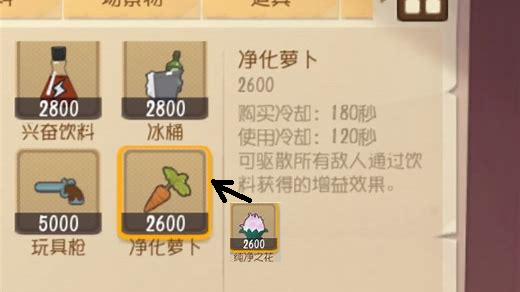

<h1 align="center">素质萝卜哥的快乐生活</h1>




<h2 align="center"><a  href="https://tom.163.com">猫和老鼠官方手游</a></h2>

### [Q群](http://qm.qq.com/cgi-bin/qm/qr?_wv=1027&k=YdfQNy9mwJmJLMjIZ_noswkbadI_xLWh&authKey=sa9pIeQ7KlqTVg8uy9Jom5du1ofDHXZAf4qgnbi3BT3Dz2DpK1mDXlj75W041AxY&noverify=0&group_code=429321217)

## 什么是素质萝卜哥

**这很重要，好吗!?**

<p align="center">
</p>

纯白之花是猫和老鼠中用来驱散敌人通过饮料获得的增益效果的道具。 然而一些没有父母的人用它用来“猫鼠上坟”，买给自己的敌人。 扰乱游戏风气，没有道德底线，恶意嘲讽他人。[大神链接](https://ds.163.com/feed/6305bb49b4e5c000010a393b/#:~:text=%E6%B8%B8%E6%88%8F%E4%B8%AD%E7%BA%AF%E7%99%BD%E4%B9%8B%E8%8A%B1%E6%98%AF%E7%94%A8%E6%9D%A5%E9%A9%B1%E6%95%A3%E6%95%8C%E4%BA%BA%EF%BC%8C%E9%80%9A%E8%BF%87%E9%A5%AE%E6%96%99%E8%8E%B7%E5%BE%97%E7%9A%84%E5%A2%9E%E7%9B%8A%E6%95%88%E6%9E%9C%E3%80%82,%E7%8E%B0%E5%9C%A8%E8%A2%AB%E2%80%9C%E6%9C%89%E5%BF%83%E4%BA%BA%E2%80%9D%E7%94%A8%E6%9D%A5%E2%80%9C%E7%8C%AB%E9%BC%A0%E4%B8%8A%E5%9D%9F%E2%80%9D%E7%8C%AB%E4%B9%B0%E7%BB%99%E9%82%A3%E4%BA%9B%E5%9D%90%E7%81%AB%E7%AE%AD%E7%9A%84%E8%80%81%E9%BC%A0%E4%BB%AC%E3%80%82%20%E7%9C%9F%E7%9A%84%E9%9D%9E%E5%B8%B8%E7%9A%84%E8%AE%BD%E5%88%BA%EF%BC%8C%E8%80%8C%E4%B8%94%E6%B2%A1%E6%9C%89%E9%81%93%E5%BE%B7%E5%BA%95%E7%BA%BF%EF%BC%8C%E4%B8%BA%E4%BA%86%E5%98%B2%E8%AE%BD%E6%97%A0%E6%89%80%E4%B8%8D%E5%B9%B2%E3%80%82)

**这个网站意在分享所有有素质的猫鼠玩家，共同欣赏猫和老鼠中一些没有家人的玩家的精彩时刻。 [AadumKhor](https://github.com/AadumKhor)[Here](https://github.com/AadumKhor/Solitaire_Flutter)** .

## How to play

### Drag and Drop [__Chrome,Opera__]:-

- **Drag** the card or the card pile you want to move.
- **Drop** the dragged card pile on the target and if the move is legal card will move
- Note:- Drag and Drop doesn't work for properly for **firefox** due to their lack of support to html Drag and drop API - https://bugzilla.mozilla.org/show_bug.cgi?id=505521 .

### Click edition [__Mobile,Firefox,Chrome,Safari,Opera__]-

- **Click** on the card or card pile you want to move .The pile turns to **blue**.
- **Click** on the
  destination card and if the move is legal the cards will
  stack below the target.

## About the project.

### Drag and Drop

- Drag and drop is implemented with native html5 drag and drop api with @drag, @dragend, @dragenter eventlisteners on the Card.vue component.
- Libraries like Vue.draggable were not used as i had to write most of the drag and drop logic according to the solitaire game type and I also had to **MOVE** the stack of cards.
- Ghost image in drag is removed instead the **whole stack** of card moves with cursor change.

### CSS

- Each and every card is 100% css except the SVG of the suit in the center of the card,which is made by illustrator tool.

  <p align="center"></p>

### 3 mode menu

Choose from 3 variants of solitaire form the main menu

<p align="center"></p>

# Variants

## **Klondike**

<p align="center">

</p>
<!--  -->

## **Spider 4 Suit**

<p align="center">

</p>

## **Spider 1 Suit**

<p align="center">

</p>

## Project setup

```
npm install
npm run serve
```

## Future scope

- Add winning animation.

## Support on Beerpay

Hey dude! Help me out for a couple of :beers:!

[](https://beerpay.io/silent-lad/VueSolitaire) [](https://beerpay.io/silent-lad/VueSolitaire?focus=wish)

